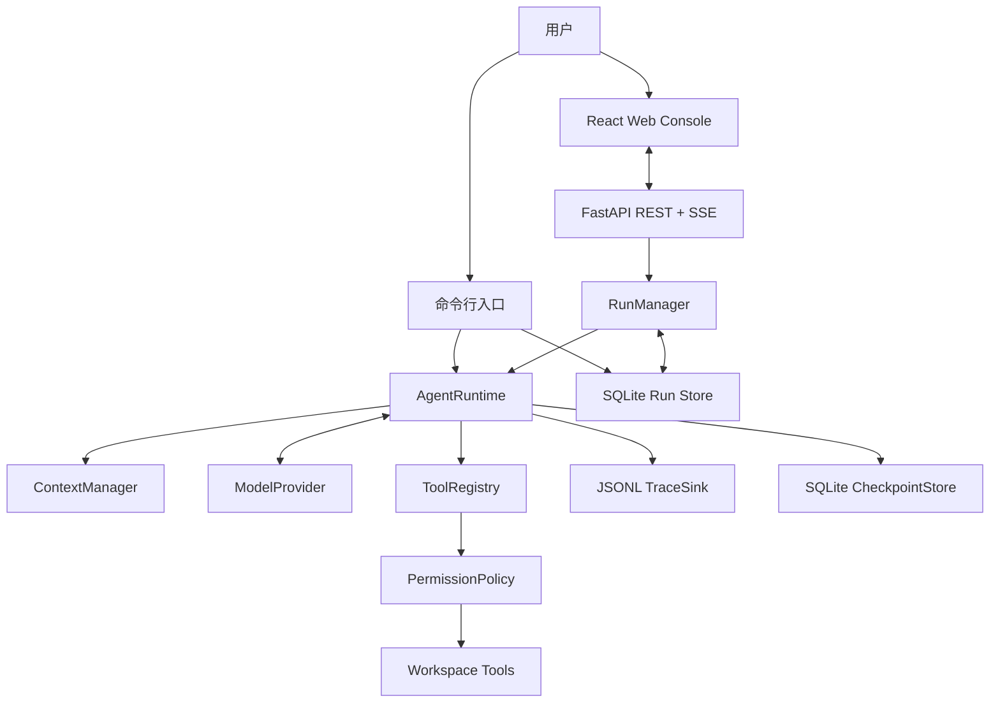
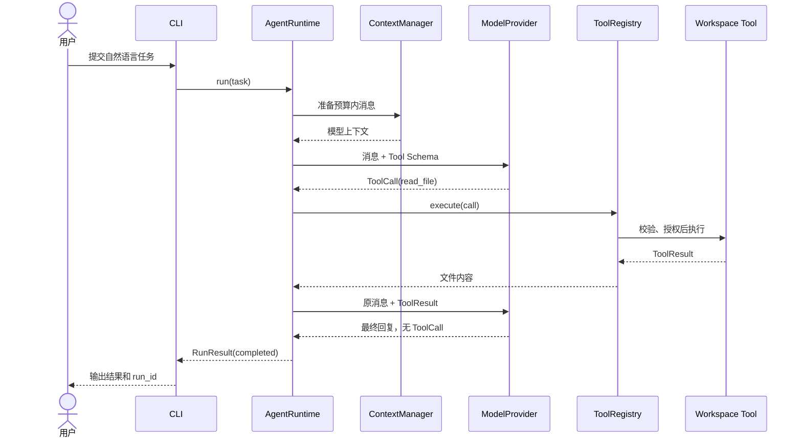
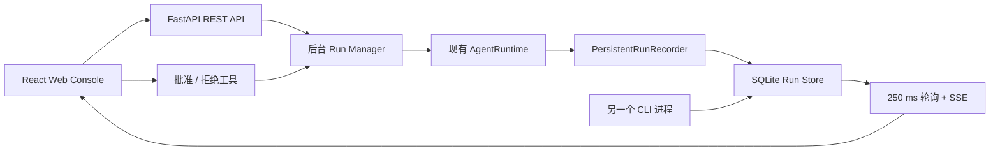

# MiniCode Agent 代码设计与技术细节

本文面向第一次接触 Agent 的开发者。阅读本文不要求了解 LangChain、MCP 或其他 Agent
框架，但需要具备基本的 Python、HTTP 和 JSON 知识。

本文对应当前仓库中的真实实现。文中会同时说明系统能够做什么、为什么这样设计，以及目前还
不能保证什么。

## 1. 先理解：Agent 到底是什么

### 1.1 大语言模型不等于 Agent

大语言模型本质上接收一组消息并生成下一条回复。只调用一次模型时，程序通常只能得到文本：

```text
用户问题 -> 模型 -> 文本答案
```

模型自身不能直接读取本地文件，也不能真正执行 Shell 命令。即使模型回复“我已经修改了
app.py”，只要外部程序没有执行文件写入，磁盘上的文件就不会发生变化。

Agent 是模型外部的一层程序。它负责重复调用模型、执行模型请求的工具、把执行结果交还模型，
直到任务完成或触发限制：

```text
用户任务 -> 模型决策 -> 工具执行 -> 结果回传 -> 模型继续决策 -> 最终回复
```

因此，本项目的核心不是训练一个新模型，而是实现这层可控制、可观察、可恢复的执行程序，也就是
Coding Agent Runtime。

### 1.2 Tool Calling 是什么

Tool Calling 表示模型不只返回自然语言，还可以返回一段结构化的“工具调用请求”。例如模型想读取
文件时，响应可以抽象为：

```json
{
  "id": "call-1",
  "name": "read_file",
  "arguments": {
    "path": "src/app.py",
    "start_line": 1,
    "end_line": 120
  }
}
```

这段 JSON 只是请求，不是已经完成的动作。Runtime 接下来需要：

1. 检查工具是否存在；
2. 校验参数是否符合 Schema；
3. 判断权限并按需请求人工确认；
4. 真正读取文件；
5. 把文件内容作为 `tool` 消息交还模型。

模型依据新的观察结果决定下一步，例如继续搜索、修改文件、运行测试，或者不再请求工具并给出
最终回复。

### 1.3 本项目中的常用概念

| 概念 | 通俗解释 | 本项目中的对应实现 |
| --- | --- | --- |
| Agent Loop | 循环调用模型和工具的控制流程 | `AgentRuntime` |
| Model Provider | 把内部消息转换成具体模型 HTTP 协议 | `OpenAICompatibleProvider` |
| Tool | Runtime 允许模型请求的一项外部能力 | `read_file`、`edit_file` 等 |
| Tool Registry | 保存工具并统一完成发现、校验和执行 | `ToolRegistry` |
| Context | 当前这次模型请求能够看到的消息 | `ContextManager` |
| Token | 模型输入和输出的计量单位 | `TokenUsage` 与运行限制 |
| Trace | 按顺序记录运行过程中发生的事件 | JSONL 轨迹 |
| Checkpoint | 可用于恢复任务的最近状态快照 | SQLite Checkpoint |
| Evaluation | 用外部校验命令判断代码任务是否成功 | `EvaluationRunner` |
| Run Manager | 管理网页创建的后台运行和实时事件 | `RunManager` |
| SSE | 服务端持续向浏览器单向推送事件 | `/api/runs/{id}/events` |

## 2. 项目目标与边界

MiniCode Agent 关注的是一个小而完整的单 Agent Runtime：

- 可以接收自然语言代码任务；
- 可以调用真实模型；
- 可以让模型读取、搜索、编辑代码并运行命令；
- 可以限制步数、Token 和上下文；
- 可以审批有副作用的工具；
- 可以记录轨迹并从 Checkpoint 恢复；
- 可以通过独立测试命令评测最终代码；
- 可以通过本地 Web Console 创建、观察、审批和恢复任务。

它目前不是以下产品：

- 不是 IDE 插件；
- 不是面向公网的多用户聊天平台；
- 不是操作系统级代码沙箱；
- 不是多 Agent 协作框架；
- 不是完整复刻 Claude Code、Codex 或 SWE-agent。

保持边界较小的目的，是让每个关键机制都能直接从源码中看懂和测试，而不是被大型框架隐藏。

## 3. 总体架构



各模块只承担一类职责：

- `cli`：读取参数和环境变量，组装所有依赖，处理终端审批；
- `runtime`：控制 Agent Loop、消息、限制、状态和停止条件；
- `models`：适配不同模型协议，不负责文件和命令操作；
- `tools`：定义模型可以请求的能力，并执行通过校验的调用；
- `security`：限制工作区路径，决定工具是否需要审批或必须拒绝；
- `persistence`：记录事件和保存恢复快照；
- `evaluation`：在独立目录运行固定任务，并用外部命令验收；
- `web`：提供 API、持久化运行查询、SSE 轮询和异步网页审批；
- `web/` 前端目录：提供 React 运行列表、时间线、事件详情和审批界面。

这种拆分有两个直接好处：

1. Runtime 不依赖某个具体模型或工具，可以用 Fake Provider 和 Stub Tool 测试；
2. CLI 和 Web API 复用同一个 Runtime，终端或网页交互不会进入核心循环。

## 4. 目录与源码入口

```text
src/minicode_agent/
├── cli.py                         # CLI 参数、依赖组装、终端审批
├── runtime/
│   ├── types.py                   # 消息、调用、结果、配置、状态等数据模型
│   ├── agent.py                   # Agent Loop 核心
│   └── context.py                 # 上下文预算与消息裁剪
├── models/
│   ├── base.py                    # ModelProvider 协议
│   ├── fake.py                    # 可预测的测试模型
│   └── openai_compatible.py       # OpenAI 兼容接口适配
├── tools/
│   ├── base.py                    # Tool 抽象类
│   ├── registry.py                # 注册、Schema、校验、权限、执行
│   ├── defaults.py                # 默认工具集合
│   ├── filesystem.py              # 文件读取、列举、搜索、编辑
│   └── shell.py                   # 有超时和输出限制的 Shell 工具
├── security/
│   ├── workspace.py               # 工作区路径边界
│   └── policy.py                  # 权限分级、审批和高风险命令拒绝
├── persistence/
│   ├── trace.py                   # JSONL 事件轨迹
│   ├── checkpoint.py              # SQLite 状态快照
│   └── run_store.py               # CLI/Web 共用的 SQLite 运行时间线
├── evaluation/
│   ├── models.py                  # 评测任务和报告 Schema
│   └── runner.py                  # 隔离任务、执行、校验、报告
└── web/
    ├── app.py                     # FastAPI、REST、SSE 和静态文件
    ├── manager.py                 # 后台任务、事件广播和网页审批
    └── models.py                  # Web API 请求与响应 Schema
web/
├── src/App.tsx                    # React 页面和交互状态
├── src/api.ts                     # API 客户端
└── src/styles.css                 # 桌面与移动端样式
```

核心源码链接：

- [`runtime/agent.py`](../src/minicode_agent/runtime/agent.py)
- [`runtime/types.py`](../src/minicode_agent/runtime/types.py)
- [`tools/registry.py`](../src/minicode_agent/tools/registry.py)
- [`security/policy.py`](../src/minicode_agent/security/policy.py)
- [`models/openai_compatible.py`](../src/minicode_agent/models/openai_compatible.py)
- [`web/manager.py`](../src/minicode_agent/web/manager.py)

## 5. 核心数据结构

数据结构集中定义在 [`runtime/types.py`](../src/minicode_agent/runtime/types.py)，并使用
Pydantic 完成类型和字段校验。

### 5.1 Message

`Message` 表示模型对话中的一条消息。`role` 有四种：

| role | 来源 | 用途 |
| --- | --- | --- |
| `system` | Runtime | 定义模型行为和边界 |
| `user` | 用户 | 描述需要完成的任务 |
| `assistant` | 模型 | 返回分析文本、最终文本或工具调用 |
| `tool` | Runtime | 返回某次工具调用的真实执行结果 |

一次读取文件的消息序列大致如下：

```text
system: 你是一个处理代码仓库任务的 Agent
user: 修复失败的测试
assistant: 请求调用 read_file(path="app.py")
tool: app.py 的实际内容
assistant: 请求调用 edit_file(...)
tool: edited app.py
assistant: 请求调用 run_shell(command="pytest")
tool: 28 passed
assistant: 修复已完成
```

`tool_call_id` 用于把工具结果和原始调用对应起来。上下文裁剪时不能只保留工具结果而丢掉对应的
Assistant 调用，否则模型看到的协议会不完整。

### 5.2 ToolCall、ToolSchema 和 ToolResult

- `ToolCall`：模型返回的工具名称、调用 ID 和参数；
- `ToolSchema`：提供给模型的工具名称、说明和 JSON Schema；
- `ToolResult`：Runtime 执行后的文本结果、错误标记和元数据。

工具失败通常不会抛出到整个 Runtime，而是转换成 `is_error=true` 的 `ToolResult`。这样模型能
看到错误并尝试修正参数或选择其他方案。

### 5.3 AgentConfig

当前默认配置如下：

| 字段 | 默认值 | 含义 |
| --- | ---: | --- |
| `max_steps` | 12 | 最多请求模型 12 次 |
| `max_total_tokens` | 100,000 | 整个任务累计 Token 上限 |
| `max_context_tokens` | 32,000 | 单次请求的估算上下文上限 |
| `stop_on_tool_error` | `false` | 工具失败后是否立即终止 |

这里的“一步”表示一次模型请求，不表示一次工具调用。一个模型响应可以包含多个工具调用，它们仍然
属于同一步。

CLI 开放了 `max_steps`、`max_context_tokens` 和 `max_total_tokens` 参数；
`stop_on_tool_error` 仍需通过代码配置，这是后续应补齐的配置入口。Chat 模式把 `max_steps`
解释为每条用户消息的步数上限，`max_total_tokens` 则限制整个会话的累计用量。

### 5.4 RunStatus

| 状态 | 触发条件 |
| --- | --- |
| `completed` | 模型返回响应且没有继续请求工具 |
| `step_limit` | 已用完允许的模型请求次数 |
| `token_limit` | 模型响应后累计 Token 超过限制 |
| `tool_error` | 工具失败且配置为遇到工具错误立即停止 |
| `failed` | 模型调用、响应解析等环节抛出异常 |

## 6. 一次任务是怎样执行的

### 6.1 CLI 负责组装依赖

执行下面的命令：

```bash
uv run minicode run "修复失败的测试" --workspace /path/to/repo
```

[`cli.py`](../src/minicode_agent/cli.py) 会完成以下工作：

1. 从 `.env` 加载 API Key、Base URL 和模型名称；
2. 把 `--workspace` 转成绝对路径；
3. 创建 OpenAI 兼容 Provider；
4. 创建默认 Tool Registry 和 Permission Policy；
5. 创建 JSONL TraceSink 和 SQLite CheckpointStore；
6. 根据命令选择 `runtime.run()` 或 `runtime.resume()`；
7. 输出 `run_id`、终态、步数和 Token 用量。

这种在入口处创建并注入依赖的方式叫依赖注入。`AgentRuntime` 不需要知道模型配置来自 `.env`，
也不需要知道审批来自终端还是未来的网页。

### 6.2 Runtime 初始化消息

`run(task)` 会生成随机 `run_id`，并创建两条不会被普通历史裁剪掉的基础消息：

```python
messages = [
    Message(role="system", content=config.system_prompt),
    Message(role="user", content=task),
]
```

随后记录 `run_started` 事件，并保存状态为 `running` 的初始 Checkpoint。

### 6.3 Agent Loop

核心循环可以简化成以下伪代码：

```python
for step in allowed_steps:
    model_messages = context.prepare(messages)
    response = await model.complete(model_messages, tool_schemas)
    messages.append(response_as_assistant_message)
    accumulate_token_usage()

    if token_limit_exceeded:
        return TOKEN_LIMIT

    if response_has_no_tool_calls:
        return COMPLETED

    for tool_call in response.tool_calls:
        tool_result = await tools.execute(tool_call)
        messages.append(tool_result_as_tool_message)

    save_consistent_checkpoint()

return STEP_LIMIT
```

需要注意三个顺序细节：

1. Token 上限在收到模型响应后检查，并且早于工具执行。因此超限响应中的工具不会被执行；
2. 一个响应内的全部工具执行完毕后才保存本轮 Checkpoint；
3. 模型不再请求工具时，Runtime 将该响应视为最终答案并进入 `completed`。

### 6.4 完整时序



### 6.5 交互式会话怎样复用上下文

`minicode chat` 和不带子命令的 `minicode` 会启动一个持续的 CLI 会话。它不是反复调用独立的
`run(task)`，而是为整个会话只创建一次 `run_id`：

```text
start_session(run_id)
  -> 保存 System Message 和 idle Checkpoint

continue_conversation(run_id, user_message)
  -> 读取同一个 Checkpoint
  -> 在完整消息历史末尾追加 User Message
  -> 从累计 steps + 1 继续 Agent Loop
  -> 保存 Assistant、Tool、累计 Token 和新的 Trace 序号
  -> 进入 session_waiting_input；达到总 Token 上限时进入 session_limit_reached
```

每条输入完成时，Runtime 仍会产生一次 `RunResult` 和 `run_finished`，用于描述这一轮是完成、达到
步数上限还是失败；随后 `session_waiting_input` 把共享摘要切换为 `idle`，表示 CLI 可以继续接收
下一条消息。退出时记录 `session_finished`，并把最终 Checkpoint 标记为 `completed`。

Chat 的 `--max-steps` 是每条消息的增量上限。例如第一条消息使用 2 步后，第二条消息仍可以再使用
最多 12 步；Checkpoint 中的 `steps` 则持续累计。总 Token 上限不会按轮重置，达到上限后需要
使用 `/clear` 创建新会话。

`/clear` 不会在同一历史上删除消息。它会正常结束旧 Run，再创建新的 Run ID 和只有 System
Message 的 Checkpoint，因此 Web 时间线和审计数据不会出现“历史被悄悄改写”的情况。

## 7. 模型适配层

`ModelProvider` 是 Runtime 依赖的最小协议：接收内部消息与工具 Schema，返回统一的
`ModelResponse`。Provider 也可以声明支持 `stream_complete()`，逐步返回 `ModelStreamChunk`；
每个 Chunk 要么携带文本增量，要么携带组装完成的最终响应。

当前真实实现是
[`OpenAICompatibleProvider`](../src/minicode_agent/models/openai_compatible.py)，它调用：

```text
POST {MINICODE_BASE_URL}/chat/completions
Authorization: Bearer {MINICODE_API_KEY}
```

Provider 主要做两次转换。

请求前：

- 把内部 `Message` 转成 OpenAI 兼容消息；
- 把 `ToolSchema` 包装成 `type=function` 的工具定义；
- 把字典类型的工具参数编码为 JSON 字符串；
- 设置 `tool_choice=auto`，由模型决定是否调用工具。

响应后：

- 流式请求设置 `stream=true` 和 `stream_options.include_usage`；
- 逐行解析 SSE 的 `data:` 内容和 `[DONE]` 结束标记；
- 把 `choices[0].delta.content` 作为临时增量事件发送给 Web Console；
- 按 `index` 拼接分片工具调用的 ID、名称和 JSON 参数；
- 转换为内部 `ToolCall`；
- 将 `prompt_tokens` 和 `completion_tokens` 转换为 `TokenUsage`。

连接结束后，Provider 将所有文本和工具分片组装为原来的 `ModelResponse`。因此工具执行、消息历史、
Token 限制、Trace 和 Checkpoint 不需要理解服务商的 SSE 格式。没有声明流式能力的 Provider 仍走
原来的 `complete()` 路径。

HTTP 错误、非法 JSON、缺少 `choices` 或工具参数不是对象时，会转换成
`ModelProviderError`。Runtime 捕获后将任务标记为 `failed`，同时记录错误轨迹和最终
Checkpoint。

Provider 默认请求超时为 120 秒，目前没有自动重试或退避。流式路径支持标准 OpenAI 兼容文本和
工具调用 Delta，不处理服务商专有事件或多模态内容分片。

### 7.1 为什么还需要 Fake Provider

[`FakeModelProvider`](../src/minicode_agent/models/fake.py) 按顺序返回预先准备的响应，不访问
网络。例如可以指定：第一次请求读取文件，第二次返回完成。

它使测试具备以下特性：

- 不消耗 API Token；
- 不受网络和模型随机性影响；
- 可以稳定制造步数超限、Token 超限和 Provider 异常；
- 可以检查 Runtime 第二次发给模型的消息是否真的包含工具结果。

## 8. 工具系统

### 8.1 从 Tool 定义到实际执行

每个 Tool 都声明：

- `name`：模型调用时使用的稳定名称；
- `description`：告诉模型该工具适合做什么；
- `permission`：读取、写入或执行；
- `input_model`：Pydantic 参数模型；
- `run()`：真正的副作用实现。

`ToolRegistry.execute()` 的处理顺序是：

```text
查找工具
  -> Pydantic 参数校验
  -> PermissionPolicy 授权
  -> Tool.run 执行
  -> 记录工具名称和耗时
  -> 返回结构化 ToolResult
```

未知工具、参数错误、权限拒绝、路径越界和常见 I/O 错误都会被转换成结构化错误，而不是让整个
Agent 进程崩溃。

### 8.2 当前五个工具

| 工具 | 权限 | 核心参数 | 行为与限制 |
| --- | --- | --- | --- |
| `read_file` | READ | 路径、起止行、最大字符数 | 读取 UTF-8 文本并添加行号，默认最多返回 12,000 字符 |
| `list_files` | READ | 路径、glob、最大结果数 | 递归列出文件，默认最多 200 个 |
| `search_text` | READ | 关键词、路径、文件模式、正则开关 | 搜索 UTF-8 文件，跳过无法解码的文件 |
| `edit_file` | WRITE | 路径、旧文本、新文本 | 只替换唯一匹配的精确文本；旧文本为空时只能创建新文件 |
| `run_shell` | EXECUTE | 命令、超时、最大字符数 | 在工作区执行 Shell，默认超时 30 秒，最长允许 120 秒 |

文件列举和搜索会忽略 `.git`、`.minicode`、`.venv`、`__pycache__` 和 `node_modules`。

`edit_file` 要求旧文本恰好出现一次。这样虽然不如 Patch 工具灵活，但可以避免模型提供的短文本
意外替换多个位置，也能让失败原因明确返回给模型。

Shell 标准错误会合并到标准输出；非零退出码会令结果的 `is_error` 为 `true`。输出超过上限时
会截断，防止巨量日志直接占满下一轮模型上下文。

## 9. 权限与安全边界

### 9.1 工作区路径限制

[`Workspace`](../src/minicode_agent/security/workspace.py) 会把根目录和目标路径都转换成规范化
绝对路径，再用共同路径判断目标是否仍位于工作区内。

因此下面的读取会被拒绝：

```text
workspace = /projects/demo
requested = ../private.txt
resolved = /projects/private.txt
```

符号链接也会在 `resolve()` 时解析。如果工作区内的链接指向工作区外，最终路径仍会被判定为
越界。

### 9.2 权限策略

默认权限规则如下：

- READ：自动允许；
- WRITE：需要 Approver 明确允许；
- EXECUTE：先检查高风险命令，再请求 Approver；
- 没有配置 Approver 时，所有写入和执行操作都拒绝。

CLI 默认使用 `ConsoleApprover`，把工具参数打印到终端并等待 `y/N`。`--yes` 会自动批准普通
写入和执行，但无法绕过内置的高风险命令拒绝规则。

Web Console 始终使用 `_WebApprover`，当前没有暴露审批模式开关。项目也没有真正的“完全访问”
或由另一个模型执行的“替我审批”：`--yes` 只是把 Approver 换成 `AlwaysApprover`，工作区边界、
敏感路径和高风险命令规则仍然生效。若后续增加 UI 模式，适合明确区分人工审批、自动批准允许项
和只读模式。

当前拒绝规则是对命令字符串中的危险片段进行检查，例如 `rm -rf`、`sudo`、`mkfs`、
`git reset --hard` 和 `git clean -fd`。

### 9.3 为什么这不是沙箱

路径检查可以约束文件工具，但 `run_shell` 启动的进程拥有当前用户的操作系统权限。Shell 命令
可以通过很多方式访问工作区外资源，简单的字符串拒绝列表也无法识别所有等价写法。

因此当前安全机制应理解为“减少误操作的应用层防护”，不能称为沙箱。对于不可信仓库或自动批准
任务，正确方向是把整个任务放入 Docker 或虚拟机，并限制文件挂载、网络、CPU、内存和运行
时间。

### 9.4 敏感文件与 Trace 风险

`.gitignore` 和 Agent 工具权限是两套机制。为避免模型通过文件工具读取常见凭据，当前
`Workspace` 会拒绝 `.env`、`.git`、`.ssh`、`.npmrc` 等敏感路径，包括这些目录中的子路径。
`.env.example`、`.env.sample` 和 `.env.template` 作为不应包含真实密钥的配置模板仍允许读取。

目录列举和文本搜索同样会跳过敏感目录及常见依赖目录。这个规则只覆盖 MiniCode Agent 的文件
工具；`run_shell` 在用户批准后仍以当前系统用户权限运行，可能通过命令访问工作区外资源或环境
变量，因此不能把敏感路径拒绝理解成完整沙箱。

此外，Trace 会保存完整工具参数与结果。如果工具读到了密钥，内容还可能进入模型上下文和本地
`.minicode/traces.jsonl`。Provider 自身不会主动把 API Key 写入 Trace，但工具读取造成的泄露
仍需单独防护。

当前使用时应遵守以下约束：

- 目标工作区内仍不要放置模型不应接触的额外凭据；
- 不要对可能读取环境变量或绕过文件工具的任务使用自动批准；
- 审批 Shell 命令前检查它是否会读取环境变量或工作区外文件；
- Trace 按敏感运行日志处理，不要直接提交或公开。

后续仍应增加可配置允许列表、工具结果脱敏和 Trace 字段脱敏。当前 Web 服务只适合监听本机，
不应直接暴露到公网。

## 10. 上下文管理

模型存在最大上下文长度，重复读取文件和运行测试会使消息不断增加。`ContextManager` 在每次模型
请求前选择需要发送的消息，但 Runtime 内存和 Checkpoint 仍保留完整历史。

### 10.1 Token 估算

当前没有使用具体模型的 Tokenizer，而是按序列化消息字符数估算：

```text
estimated_tokens = ceil(serialized_characters / 4)
```

这种方式实现简单、与供应商无关，但对中文、代码和不同模型只能近似估算。

### 10.2 裁剪策略

算法始终保留前两条基础消息：

1. System Prompt；
2. 原始用户任务。

在交互式会话中，算法还会把最新一条 User Message 及其之后的 Assistant/Tool 链路作为当前轮次
锚点保留，避免历史变长后模型反而看不到用户刚刚提出的问题。

后续历史按完整对话块分组：一个 Assistant 消息，以及紧随其后的全部 Tool 消息属于同一个块。
算法从最新块向旧块添加，直到继续添加会超过预算。若空间允许，还会插入一条系统消息，告诉模型
有多少条旧执行消息被省略。

这样可以避免出现下面这种无效上下文：

```text
tool: app.py 的文件内容
```

但模型看不到是哪次 `read_file` 调用产生了该结果。

当前实现不会摘要旧内容；如果最初的 System Prompt 或用户任务自身已经超出预算，也不会进一步
截断它们。这些都是后续可以改进的边界。

## 11. Trace：用于观察发生过什么

Trace 是按时间追加的事件日志，默认写入目标工作区：

```text
.minicode/traces.jsonl
```

JSONL 表示每一行都是一个完整 JSON 对象。追加写入比维护一个大型 JSON 数组简单，进程异常退出
时通常也能保留之前已经写入的完整行。

主要事件类型包括：

| 事件 | 记录内容 |
| --- | --- |
| `run_started` | 原始任务与 Runtime 配置 |
| `model_response` | 步数、模型文本、工具调用、Token、上下文消息数 |
| `tool_result` | 调用参数、结果、错误状态、审批耗时和实际工具耗时 |
| `model_error` | Provider 或上下文准备异常 |
| `run_resumed` | 从哪个状态和第几步恢复 |
| `run_finished` | 最终状态、步数、累计 Token 和错误 |
| `session_started` | 交互式 CLI 会话建立 |
| `user_message` | 会话中新追加的用户输入 |
| `session_waiting_input` | 本轮结束，等待下一条输入 |
| `session_limit_reached` | 会话达到累计 Token 上限，只能退出或清空 |
| `session_finished` | 用户退出或清空会话 |

每个运行使用独立的 `run_id`，事件通过从 1 递增的 `sequence` 排序。恢复任务时会从 Checkpoint
保存的轨迹序号继续递增。

Trace 适合回答“模型为什么这么做”和“哪一步失败”，但它不是恢复来源，也不会自动重新驱动任务。

### 11.1 Run Store：用于 CLI/Web 共用时间线

CLI 和 Web 都会在目标工作区写入：

```text
.minicode/runs.db
```

这个 SQLite 数据库包含两张核心表：

- `runs`：保存任务、来源、模型、配置、状态、Token、结果和事件数量等摘要；
- `events`：以 `(run_id, id)` 为主键保存该任务按顺序增长的界面事件。

`PersistentRunRecorder` 把每个 Runtime Trace 同时写入 JSONL 和 Run Store。模型流式文本不进入
JSONL，但会按时间或字符数合并成较大的 `model_output_delta` 后写入 Run Store，从而兼顾实时性和
SQLite 写入频率。不同进程使用 WAL 和 `BEGIN IMMEDIATE` 分配事件序号，因此 CLI 写入后，Web
通过新的数据库连接就能读取，不需要把 CLI 请求转发给 Web。

Run Store 是观察层，不是执行控制层。Web 只在内存中保留自己启动的后台任务与审批 Future；它
看到 `source=cli` 的运行时，只展示摘要和时间线，不允许网页审批或恢复。这个边界避免 Web 在没有
CLI 执行上下文的情况下假装接管任务。

## 12. Checkpoint：用于恢复任务

Checkpoint 默认写入：

```text
.minicode/checkpoints.db
```

SQLite 表以 `run_id` 为主键，每个任务只保存最近一份 JSON 快照，内容包括：

- 原始任务；
- 当前状态；
- 完整消息历史；
- 已完成步数；
- 累计 Token；
- Trace 序号；
- 输出和错误。

SQLite 使用 WAL 日志模式，以 `INSERT ... ON CONFLICT DO UPDATE` 更新快照。

Checkpoint 会在以下位置保存：

1. 任务刚创建时；
2. 一轮模型响应中的全部工具执行完毕后；
3. 任务进入任意终态时；
4. 恢复任务刚开始时。

`resume(run_id)` 会拒绝不存在或已经 `completed` 的任务。对于可恢复任务，它沿用相同 `run_id`、
消息、Token 用量和 Trace 序号，并从 `completed_steps + 1` 开始。

Checkpoint 保存的是应用层一致边界，但仍有一个重要限制：如果进程在文件已经修改、但本轮
Checkpoint 尚未保存时崩溃，磁盘副作用已经发生，恢复后模型可能再次请求类似操作。未来可通过
Git worktree、幂等工具或工具级事务记录降低这一风险。

## 13. Trace、Run Store 与 Checkpoint 为什么要分开

三者解决的问题不同：

| 对比项 | Trace | Run Store | Checkpoint |
| --- | --- | --- | --- |
| 目的 | 人类审计和排查 | CLI/Web 列表与时间线 | 恢复运行状态 |
| 数据形式 | JSONL 只追加事件 | SQLite 摘要与有序事件 | 每个任务一份最新快照 |
| 是否保留界面事件 | 只保留 Runtime Trace | 是，包括流式和审批事件 | 否 |
| 主要查询方式 | 按行或 `run_id` 分析 | 按工作区、`run_id`、事件 ID 查询 | 按 `run_id` 读取 |

只使用 Trace，Web 每次查询都要扫描文件且难以可靠地跨进程续订；只使用 Run Store，恢复所需的
完整消息状态会让观察表过度复杂；只使用 Checkpoint，则看不到状态为何变化。三个存储分别承担
审计、观察和恢复，比让一个格式承担所有职责更容易理解和测试。

## 14. 评测系统

模型说“任务完成”不代表代码真的正确。评测系统使用模型之外的校验命令作为成功标准。

[`evals/tasks.json`](../evals/tasks.json) 中的每个任务包含：

- 稳定任务 ID；
- 给模型的 Prompt；
- 初始仓库文件；
- 验收命令；
- 验收超时。

`EvaluationRunner` 对每题执行：

```text
创建独立目录
  -> 写入题目初始文件
  -> 自动批准该目录内的 Agent 工具
  -> 运行正常 AgentRuntime
  -> 无论模型最终怎么说，都执行独立 verify_command
  -> 记录是否通过、步数、Token、耗时和校验输出
```

每完成一题都会重写一次 `report.json`，因此中途失败时仍可能保留已经完成题目的报告。

当前 3 题基线是自建的功能回归集，只能证明这 3 个固定任务通过，不能等同于 SWE-bench 等公开
Benchmark。评测命令仍直接运行在宿主机，所以外部任务文件也必须视为可执行代码，只能运行可信
来源。

## 15. 测试策略

项目当前有 48 项自动化测试，主要遵循“核心逻辑使用确定性替身，外部边界使用模拟”的思路：

- Agent Runtime：使用 Fake Provider 和 Stub Tool；
- HTTP Provider：使用 `httpx.MockTransport`，不发送真实请求；
- 文件与 Shell：使用 Pytest 临时目录；
- 审批：使用固定返回允许或拒绝的 Approver；
- Checkpoint：使用临时 SQLite 文件；
- Run Store：验证跨连接可见性、事件排序、摘要投影和流式分片合并；
- CLI：调用命令入口并检查输出与退出码；
- 交互会话：验证跨轮消息、累计 Token、会话命令和 `/clear` 后的新 Run；
- Evaluation：使用临时题目和确定性校验命令；
- Web API：使用进程内 ASGI 客户端验证创建、审批、事件、停止限制和恢复。

真实模型评测用于验证完整链路，但不能替代单元测试，因为模型输出具有成本、延迟和不确定性。

## 16. 现在怎样运行和观察项目

### 16.1 离线演示

```bash
uv sync --all-groups
uv run minicode demo --workspace .
```

Demo 使用 Fake Provider，只读取一个项目文件，不需要 API Key。

### 16.2 Web Console

首次安装并构建前端：

```bash
cd web
npm install
npm run build
cd ..
uv run minicode web --demo --workspace /path/to/repository
```

打开 <http://127.0.0.1:8000>。`--demo` 不消耗 API Token，但会完整演示模型流式文本、SSE 和
网页审批。使用 `.env` 中配置的真实模型时运行
`uv run minicode web --workspace /path/to/repository`。详细说明见
[《Web Console 使用与设计说明》](web-console.zh-CN.md)。

### 16.3 交互式 CLI 会话

```bash
uv run minicode chat --workspace /path/to/repository
```

也可以直接运行 `uv run minicode`，此时默认使用当前目录作为工作区。进入后连续输入自然语言任务，
使用 `/status` 查看累计状态，使用 `/history` 查看用户消息，使用 `/clear` 新建无历史会话，使用
`/exit`、`/quit`、`exit` 或 `quit` 退出。对于可信任务可以在启动时增加 `--yes`。

希望从任意目录直接使用短命令时，可执行一次：

```bash
uv tool install -e /absolute/path/to/minicode-agent
```

之后在目标仓库中运行 `minicode` 即可。模型配置需要存在于 Shell 环境变量或启动目录的 `.env`。

### 16.4 真实 CLI 单次任务

```bash
uv run minicode run \
  "检查项目结构，找出测试失败原因并进行最小修改" \
  --workspace /path/to/repository
```

不要对不可信仓库使用 `--yes`。正常模式下，读取自动允许，写文件和 Shell 命令会显示参数并等待
人工确认。

### 16.5 恢复 CLI 任务

```bash
uv run minicode resume RUN_ID \
  --workspace /path/to/repository \
  --max-steps 24
```

恢复时必须指向原工作区，因为 Checkpoint 数据库位于该工作区的 `.minicode` 目录。

### 16.6 运行评测和测试

```bash
uv run minicode eval --tasks evals/tasks.json
uv run ruff check .
uv run pytest --cov
```

## 17. 当前实现的主要限制

理解限制和理解能力同样重要：

1. Provider 只适配 `/chat/completions` 的标准 SSE，没有服务商专有协议、自动重试和限流；
2. 上下文按字符数估算 Token，没有模型专用 Tokenizer，也没有历史摘要；
3. Trace 没有通用的秘密信息内容脱敏；
4. Shell 在宿主机运行，拒绝列表不能替代 Docker 沙箱；
5. Web 只自动发现默认工作区和本进程已注册工作区，旧 JSONL 不会自动回填共享列表；
6. 没有主动取消、跨进程任务队列、多用户认证、Git Diff 和测试结果专用视图；
7. Checkpoint 不能为未记录的文件副作用提供事务回滚；
8. 文件工具只处理 UTF-8 文本，`edit_file` 只支持唯一精确替换；
9. 评测集规模很小，不能作为通用 Coding Agent 能力结论；
10. 没有 MCP、插件系统、多 Agent、长期记忆或 RAG。

这些限制不是通过修改宣传措辞解决的，而应在后续版本中逐项实现、测试和评测。

## 18. Web Console 怎样接入 Runtime

Web 界面没有复制 Agent Loop，而是在现有 Runtime 外增加服务和事件适配：



`RunManager` 为每个任务预分配 `run_id`，在后台 `asyncio.Task` 中运行 `AgentRuntime`。
`PersistentRunRecorder` 一边把 Runtime 事件追加到 JSONL，一边写入工作区的 `runs.db`。
`_WebApprover` 使用 `asyncio.Future` 等待浏览器的批准或拒绝，等待期间不会阻塞其他 HTTP 请求。

React 前端通过 REST 创建、查询、审批和恢复 Web 任务，通过 SSE 接收增量事件。它展示 CLI/Web
来源、模型、状态、指标、执行时间线和原始事件 JSON。SSE 从 Run Store 按事件 ID 轮询，因此同一
工作区中另一个 CLI 进程产生的新事件也会出现。CLI 运行在网页中只读，审批和恢复仍由 CLI 负责。

模型文本分片作为 `model_output_delta` Web 事件实时发送，React 按模型步数合并为一个持续增长的
输出区域，避免每个分片占据一条时间线记录。高频分片经批量合并后写入 Run Store，但不写入
JSONL Trace；最终完整 `model_response` 到达后替换临时输出，并按原有流程持久化。

当前 API 路径、运行时序、持久化边界和界面操作详见
[《Web Console 使用与设计说明》](web-console.zh-CN.md)。下一阶段应补充任务取消、跨工作区索引、
Git Diff、测试结果视图和 Docker 隔离。

## 19. 推荐源码阅读顺序

第一次阅读时，不建议从 CLI 一路追所有调用。可以按下面顺序逐层增加复杂度：

1. [`runtime/types.py`](../src/minicode_agent/runtime/types.py)：先认识系统交换的数据；
2. [`models/fake.py`](../src/minicode_agent/models/fake.py)：理解“模型”在 Runtime 看来只是一个接口；
3. [`tests/test_agent_runtime.py`](../tests/test_agent_runtime.py)：通过最短示例理解循环；
4. [`runtime/agent.py`](../src/minicode_agent/runtime/agent.py)：阅读真正的控制流；
5. [`tools/registry.py`](../src/minicode_agent/tools/registry.py)：理解工具校验和执行；
6. [`security/workspace.py`](../src/minicode_agent/security/workspace.py) 和
   [`security/policy.py`](../src/minicode_agent/security/policy.py)：理解安全边界；
7. [`runtime/context.py`](../src/minicode_agent/runtime/context.py)：理解消息如何进入模型；
8. [`persistence`](../src/minicode_agent/persistence)：理解观察和恢复；
9. [`models/openai_compatible.py`](../src/minicode_agent/models/openai_compatible.py)：理解真实 HTTP 协议；
10. [`cli.py`](../src/minicode_agent/cli.py) 和
    [`evaluation/runner.py`](../src/minicode_agent/evaluation/runner.py)：最后看完整组装和评测。
11. [`web/manager.py`](../src/minicode_agent/web/manager.py) 和
    [`web/app.py`](../src/minicode_agent/web/app.py)：理解后台运行、网页审批、REST 和 SSE。

## 20. 初学者常见问题

### 模型会直接执行工具吗？

不会。模型只返回工具调用请求，Runtime 才是真正执行工具的一方。

### 为什么不给模型一个万能 Shell 就结束？

结构化文件工具更容易校验参数、限制路径、记录结果和请求审批。Shell 仍然保留用于测试和复杂
命令，但风险更高。

### 模型最终回复“完成”就算成功吗？

普通运行会进入 `completed`，但这只表示模型停止请求工具。评测是否成功仍由独立校验命令决定。

### Context 和 Checkpoint 有什么区别？

Context 是本次发送给模型的有限消息；Checkpoint 是恢复任务所需的完整状态快照。旧消息可能不
进入当前 Context，但仍会保留在 Checkpoint 中。

### 为什么不直接使用 Agent 框架？

这个项目的目标是理解和展示 Runtime 的核心工程机制。接口边界稳定后，未来仍可以接入框架或
协议，但当前自研的小循环更容易测试和解释。

### 这个项目现在最值得增加什么？

优先增加任务取消、Git Diff 和测试结果视图，再增加 Docker 隔离。它们能够在保留当前 Runtime
设计的同时，继续补齐真实使用体验和安全边界。
