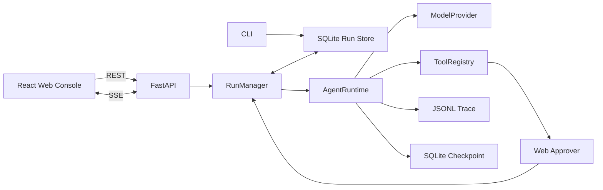

# MiniCode Agent Web Console 使用与设计说明

本文说明怎样启动 Web Console、页面上的信息来自哪里，以及 React、FastAPI、Run Manager、
Agent Runtime 和持久化层如何协作。第一次接触 Agent 时，建议先读
[《代码设计与技术细节》](code-design.zh-CN.md)，再阅读本文。

## 1. Web Console 解决什么问题

CLI 已经能运行任务，但它不适合持续观察一条较长的 Agent 轨迹。Web Console 在不复制
Agent Loop 的前提下，补上了以下交互：

- 创建任务并设置工作区、最大步数、上下文预算和总 Token 预算；
- 查看模型响应、工具调用、运行状态和最终结果组成的时间线；
- 在浏览器中批准或拒绝写文件、执行 Shell 等有副作用的操作；
- 通过 SSE 自动接收运行事件，无需频繁刷新；
- 实时拼接并显示模型返回的文本分片；
- 查看单个事件的原始 JSON 数据；
- 恢复因步数、Token、工具或模型错误而停止的任务；
- 查看同一工作区中由 CLI 进程写入的运行时间线；
- 在桌面和移动端使用同一套界面。

Web Console 是本地开发工具，不是面向公网的多用户服务。

## 2. 启动方式

项目需要 Python 3.12+、`uv` 和 Node.js/npm。

### 2.1 首次构建前端

```bash
uv sync --all-groups
cd web
npm ci
npm run build
cd ..
```

`npm run build` 会把静态文件生成到 `web/dist/`。该目录是构建产物，不提交到 Git。

### 2.2 不消耗 API Token 的演示

```bash
uv run minicode web --demo --workspace /path/to/repository
```

浏览器打开 <http://127.0.0.1:8000>，创建任意任务。Fake Provider 会固定请求：

```json
{
  "name": "run_shell",
  "arguments": { "command": "pwd" }
}
```

在 macOS/Linux 上，页面会进入“等待审批”。批准后执行 `pwd`，第二次模型响应会以分片形式实时
显示。这条路径适合检查页面、模型流式输出、SSE 和审批链路，不会调用外部模型。

Windows 上 Fake Provider 会改为请求 `Get-Location`。Demo、真实模型任务和评测都会使用服务
启动时检测到的同一个 Shell Backend，不会让 Web 路径与 CLI 路径使用不同的命令语言。

### 2.3 原生 Windows PowerShell

Windows 10/11 不需要 WSL。首次构建和启动可在 PowerShell 中执行：

```powershell
uv sync --all-groups
Set-Location web
npm ci
npm run build
Set-Location ..
Copy-Item .env.example .env
uv run minicode web --workspace "C:\Users\damon\projects\demo" --port 8000
```

程序优先使用 `pwsh.exe`，没有 PowerShell 7 时回退到 `powershell.exe`。页面顶部的连接状态会显示
实际 Shell，完整的操作系统、Shell 类型和版本可从 `/api/health` 查询。

### 2.4 使用真实模型

先在项目根目录创建本地 `.env`：

```dotenv
MINICODE_API_KEY=your-api-key
MINICODE_BASE_URL=https://your-provider.example/v1
MINICODE_MODEL=your-model-name
```

然后运行：

```bash
uv run minicode web --workspace /path/to/repository
```

`.env` 只从启动命令所在目录读取。请在项目根目录启动，且不要提交真实密钥。

真实模型必须兼容 OpenAI `/chat/completions` 的 SSE 格式：请求接受 `stream: true` 和
`stream_options.include_usage`，文本位于 `choices[0].delta.content`，工具调用位于
`choices[0].delta.tool_calls`，并以 `data: [DONE]` 结束。

### 2.5 常用启动参数

```bash
uv run minicode web \
  --host 127.0.0.1 \
  --port 8000 \
  --workspace /path/to/repository \
  --web-dist web/dist
```

`--workspace` 会在服务启动时校验目录，并作为新任务弹窗的默认值；弹窗中的路径仍可修改，用于
临时切换到另一个现有目录。默认只监听本机回环地址。除非已经增加认证、网络隔离和操作系统级
沙箱，否则不要监听公网地址。

Web 只会自动发现这个默认工作区中的 CLI 记录。要让 CLI 时间线出现在页面中，两边必须传入同一
个 `--workspace`。服务运行期间从网页使用过的其他工作区也会加入本进程的可查询范围。

### 2.6 同时运行演示和真实模型

端口与模型模式没有固定绑定，默认端口都是 `8000`。同时运行两个服务时需要显式选择不同的空闲
端口，例如：

```bash
# 终端一：演示模型
uv run minicode web --demo --port 8000 --workspace /path/to/repository

# 终端二：.env 中的真实模型
uv run minicode web --port 8001 --workspace /path/to/repository
```

此时分别打开 <http://127.0.0.1:8000> 和 <http://127.0.0.1:8001>。`8000` 与 `8001` 只是文档
示例，不是程序写死的规则；端口被占用时换成其他空闲值即可。

## 3. 页面怎样使用

页面分为三个工作区：

1. 左侧运行列表：展示工作区中持久化的 CLI/Web 任务，每 2 秒刷新一次，可按任务、工作区、来源或
   模型搜索；
2. 中间运行区：显示任务状态、步数、Token、事件数量和实时执行时间线；
3. 右侧检查区：显示运行配置、待审批操作和选中事件的完整 JSON。

一次模型步骤产生的工具请求、审批和工具结果会组成一个默认折叠的工具调用组。展开后仍可逐条
选择事件；事件详情标题旁的复制按钮会复制当前显示的 JSON 数据。

点击“新任务”后填写：

| 字段 | 默认值 | 后端范围 | 作用 |
| --- | ---: | ---: | --- |
| 最大步数 | 12 | 1 到 100 | 最多请求模型多少轮 |
| 上下文 Token | 32,000 | 128 到 1,000,000 | 单次模型请求可见历史的估算预算 |
| 总 Token | 100,000 | 1 到 10,000,000 | 整个运行累计模型 Token 上限 |

工作区必须是服务所在机器上的现有目录。服务会在该目录下创建 `.minicode/` 保存共享时间线、
Trace 和 Checkpoint。来源徽标会标明任务由 `CLI` 还是 `WEB` 发起；CLI 任务只用于观察，不能
从网页审批或恢复。CLI 等待审批时，页面会提示回到原终端处理。

`minicode chat` 创建的记录还会显示 `CHAT` 徽标。时间线会连续展示 `session_started`、每条
`user_message`、模型与工具事件、`session_waiting_input` 和最终的 `session_finished`。状态为
“等待输入”时说明 CLI 会话仍然存在，下一条消息仍会进入同一个 Run 和同一份模型上下文。
达到累计 Token 上限时会显示 `session_limit_reached`，此时需要在 CLI 使用 `/clear` 新建会话。

移动端会把运行列表变成侧边抽屉，并在待审批时把审批面板固定在视口底部，避免必须滚动到页面
末尾才能批准操作。

## 4. 总体结构



前端不直接调用模型，也不执行工具。所有模型和工具操作仍由现有 `AgentRuntime` 完成。
Web 层只负责创建后台任务、转发事件、等待审批结果和把状态转换成 HTTP 数据。

## 5. 一次 Web 任务的生命周期

```text
浏览器 POST /api/runs
  -> RunManager 预分配 run_id 并记录 run_queued
  -> 后台 asyncio Task 启动 AgentRuntime
  -> Runtime 以 stream=true 请求模型
  -> Provider 解析文本和工具调用分片
  -> model_output_delta 经 SSE 增量显示在浏览器
  -> Provider 组装最终 ModelResponse
  -> Recorder 同时写入 JSONL Trace 和 SQLite Run Store
  -> SSE 轮询 Run Store 并把新事件发送到浏览器
  -> 有副作用的工具进入 waiting_approval
  -> 浏览器提交批准或拒绝
  -> Runtime 继续执行工具和下一轮模型
  -> completed 或其他终态
```

每条运行有两个事件序号：

- `runtime_sequence` 是持久化 Trace 中的序号；
- `id` 是 Run Store 为该 `run_id` 分配的持久化时间线序号。

两者分开是因为 `run_queued`、`model_output_delta`、`approval_required` 等界面事件并不全是
Runtime Trace 事件。高频 `model_output_delta` 会按 100 ms 或 128 字符合并后写入 Run Store，
避免每个字符都触发一次 SQLite 写入；完整的 `model_response` 仍写入 JSONL Trace 和 Checkpoint。
SSE 每约 250 ms 查询一次新增事件，因此能看到另一个 CLI 进程刚写入的时间线而不需要进程间 IPC。

## 6. 网页审批为什么不会阻塞服务

`_WebApprover` 为每次审批创建一个 `asyncio.Future`。当前运行会异步等待这个 Future，但 FastAPI
事件循环仍能处理查询、SSE 和审批请求。浏览器调用审批接口后，Run Manager 设置 Future 的结果，
原 Agent Runtime 从等待点继续执行。

工具事件中有两个不同耗时：

- `authorization_ms`：从请求审批到用户做出决定的时间；
- `duration_ms`：真正执行工具本身的时间。

人工思考时间不会被误算成 Shell 或文件工具的执行耗时。

拒绝操作时，Runtime 会把拒绝结果作为工具观察返回模型，而不是绕过审批直接执行。

### 6.1 取消与恢复

Web 创建且仍处于排队、模型请求、工具执行或等待审批状态的任务，标题区域会显示“取消任务”。
取消请求先写入 `run_cancel_requested`，随后取消对应的 `asyncio.Task`。如果正在执行 Shell，Shell
Backend 会先终止整个进程树；如果正在等待审批，待审批 Future 会随任务一同取消。

任务最终写入 `run_cancelled`，并把最近一个内部一致边界保存为 `cancelled` Checkpoint。取消状态
可以再次点击“恢复运行”，继续使用原来的 `run_id`、消息、Token、步数和 Trace 序号。已经完成的
文件写入或外部命令副作用不会回滚。页面不能取消 `source=cli` 的运行，因为 Web 进程不拥有对应
CLI 的任务句柄；CLI 使用 `Ctrl+C` 时会自行记录取消状态。

## 7. API

| 方法 | 路径 | 作用 |
| --- | --- | --- |
| `GET` | `/api/health` | 查询服务状态、模型名、默认工作区、操作系统和 Shell 信息 |
| `GET` | `/api/runs` | 查询已注册工作区中的持久化运行列表 |
| `POST` | `/api/runs` | 创建并异步启动任务 |
| `GET` | `/api/runs/{id}` | 查询一次运行的最新摘要 |
| `GET` | `/api/runs/{id}/events/history` | 查询 Run Store 中的完整时间线事件 |
| `GET` | `/api/runs/{id}/events` | 订阅 SSE 实时事件 |
| `POST` | `/api/runs/{id}/approval` | 批准或拒绝当前 Web 任务的待审批操作 |
| `POST` | `/api/runs/{id}/resume` | 使用新限制从 Checkpoint 恢复 Web 任务 |
| `POST` | `/api/runs/{id}/cancel` | 取消当前 Web 进程拥有的活动任务 |

创建任务示例：

```json
{
  "task": "运行测试并修复失败用例",
  "workspace": "/absolute/path/to/repository",
  "max_steps": 12,
  "max_context_tokens": 32000,
  "max_total_tokens": 100000
}
```

SSE 支持标准 `Last-Event-ID` 请求头。连接中断后，前端可以从最后收到的持久化事件继续获取，
避免短暂断线造成事件缺失。

## 8. 哪些数据会保存

数据分为两层：

| 数据 | 保存位置 | 服务重启后 |
| --- | --- | --- |
| CLI/Web 运行列表、状态摘要、时间线事件 | `<workspace>/.minicode/runs.db` | 保留 |
| 模型响应、工具结果和终态 Trace | `<workspace>/.minicode/traces.jsonl` | 保留 |
| 可恢复的完整消息、Token 和步数快照 | `<workspace>/.minicode/checkpoints.db` | 保留 |
| Web 后台任务句柄、待审批 Future | Run Manager 内存 | 清空 |

三个文件职责不同：`runs.db` 服务于列表和时间线查询，`traces.jsonl` 服务于人类审计，
`checkpoints.db` 服务于恢复。旧版本已经存在的 JSONL 不会自动导入 `runs.db`。服务也不会扫描
整台机器寻找所有工作区，只读取启动参数指定的默认工作区，以及当前进程已注册的其他工作区。

Web 服务重启后仍能看到默认工作区的历史摘要和事件，但内存中的 Web 执行句柄与待审批 Future
无法恢复。CLI 发起的运行始终只读；即使页面看到了 `waiting_approval`，也必须回原终端处理。

## 9. 安全边界

- 文件工具只能访问选定工作区，并拒绝 `.env`、`.git`、`.ssh`、`.npmrc` 等敏感路径；
- `.env.example`、`.env.sample` 和 `.env.template` 允许读取，便于模型理解配置格式；
- 写文件和执行 Shell 需要网页审批，内置高风险命令仍会直接拒绝；
- Shell 命令仍以当前系统用户身份运行，网页审批和字符串拒绝规则不是沙箱；
- Trace 会保存工具参数与结果，应视为可能包含项目敏感信息的本地日志。

### 9.1 当前审批方式

权限类型和运行时审批方式是两个不同概念：

- 工具权限分为 `READ`、`WRITE` 和 `EXECUTE`；
- CLI 默认是人工审批：读取自动允许，写入和执行在终端等待 `y/N`；
- CLI 的 `--yes` 是自动批准普通写入和执行，不是无边界的“完全访问”；
- Web Console 当前固定为人工网页审批，尚未提供运行前的审批模式选择；
- 当前没有由另一个模型判断风险的“替我审批”模式。

无论使用人工审批还是 CLI `--yes`，工作区边界、敏感路径拒绝和高风险 Shell 命令拒绝都继续
生效。后续如果增加模式选择，建议使用“人工审批 / 自动批准允许项 / 只读”这样的准确命名，避免
把应用层自动批准误称为完整系统权限。

真实任务应使用可信仓库。对不可信代码需要 Docker 或虚拟机隔离，并限制挂载目录、网络、CPU、
内存和执行时间。

## 10. 开发与验证

后端检查：

```bash
uv run ruff check .
uv run pytest --cov
```

前端检查：

```bash
cd web
npm run check
npm run build
```

修改前端后需要重新运行 `npm run build`，正在运行的 FastAPI 服务才会提供新的 `web/dist` 文件。

开发入口：

- `src/minicode_agent/web/app.py`：REST、SSE 和静态文件服务；
- `src/minicode_agent/web/manager.py`：运行状态、后台任务、事件广播和网页审批；
- `src/minicode_agent/web/models.py`：API 请求与响应 Schema；
- `web/src/App.tsx`：页面状态和主要组件；
- `web/src/api.ts`：浏览器 API 调用；
- `web/src/styles.css`：桌面与移动端布局。

## 11. 当前未实现

- 自动发现未配置的其他工作区；
- Git Diff 和测试结果的专用视图；
- 服务商专有的流式协议和非文本内容分片；
- 多进程任务队列和跨实例事件总线；
- Docker 执行沙箱；
- 多用户账号、鉴权和权限隔离；
- MCP、插件系统和多 Agent 编排。

这些边界决定了当前 Web Console 适合本地演示、学习和单用户开发，不适合直接部署成公网服务。
