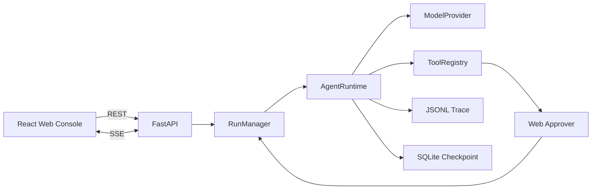

# MiniCode Agent Web Console 使用与设计说明

本文说明怎样启动 Web Console、页面上的信息来自哪里，以及 React、FastAPI、Run Manager、
Agent Runtime 和持久化层如何协作。第一次接触 Agent 时，建议先读
[《代码设计与技术细节》](code-design.zh-CN.md)，再阅读本文。

## 1. Web Console 解决什么问题

CLI 已经能运行任务，但它不适合持续观察一条较长的 Agent 轨迹。Web Console 在不复制
Agent Loop 的前提下，补上了以下交互：

- 创建任务并设置工作区、最大步数、上下文预算和总 Token 预算；
- 查看模型响应、工具调用、运行状态和最终结果组成的时间线；
- 在浏览器中批准或拒绝写文件、执行 Shell 等有副作用的操作；
- 通过 SSE 自动接收运行事件，无需频繁刷新；
- 实时拼接并显示模型返回的文本分片；
- 查看单个事件的原始 JSON 数据；
- 恢复因步数、Token、工具或模型错误而停止的任务；
- 在桌面和移动端使用同一套界面。

Web Console 是本地开发工具，不是面向公网的多用户服务。

## 2. 启动方式

项目需要 Python 3.12+、`uv` 和 Node.js/npm。

### 2.1 首次构建前端

```bash
uv sync --all-groups
cd web
npm install
npm run build
cd ..
```

`npm run build` 会把静态文件生成到 `web/dist/`。该目录是构建产物，不提交到 Git。

### 2.2 不消耗 API Token 的演示

```bash
uv run minicode web --demo --workspace /path/to/repository
```

浏览器打开 <http://127.0.0.1:8000>，创建任意任务。Fake Provider 会固定请求：

```json
{
  "name": "run_shell",
  "arguments": { "command": "pwd" }
}
```

页面会进入“等待审批”。批准后执行 `pwd`，第二次模型响应会以分片形式实时显示。这条路径适合
检查页面、模型流式输出、SSE 和审批链路，不会调用外部模型。

### 2.3 使用真实模型

先在项目根目录创建本地 `.env`：

```dotenv
MINICODE_API_KEY=your-api-key
MINICODE_BASE_URL=https://your-provider.example/v1
MINICODE_MODEL=your-model-name
```

然后运行：

```bash
uv run minicode web --workspace /path/to/repository
```

`.env` 只从启动命令所在目录读取。请在项目根目录启动，且不要提交真实密钥。

真实模型必须兼容 OpenAI `/chat/completions` 的 SSE 格式：请求接受 `stream: true` 和
`stream_options.include_usage`，文本位于 `choices[0].delta.content`，工具调用位于
`choices[0].delta.tool_calls`，并以 `data: [DONE]` 结束。

### 2.4 常用启动参数

```bash
uv run minicode web \
  --host 127.0.0.1 \
  --port 8000 \
  --workspace /path/to/repository \
  --web-dist web/dist
```

`--workspace` 会在服务启动时校验目录，并作为新任务弹窗的默认值；弹窗中的路径仍可修改，用于
临时切换到另一个现有目录。默认只监听本机回环地址。除非已经增加认证、网络隔离和操作系统级
沙箱，否则不要监听公网地址。

### 2.5 同时运行演示和真实模型

端口与模型模式没有固定绑定，默认端口都是 `8000`。同时运行两个服务时需要显式选择不同的空闲
端口，例如：

```bash
# 终端一：演示模型
uv run minicode web --demo --port 8000 --workspace /path/to/repository

# 终端二：.env 中的真实模型
uv run minicode web --port 8001 --workspace /path/to/repository
```

此时分别打开 <http://127.0.0.1:8000> 和 <http://127.0.0.1:8001>。`8000` 与 `8001` 只是文档
示例，不是程序写死的规则；端口被占用时换成其他空闲值即可。

## 3. 页面怎样使用

页面分为三个工作区：

1. 左侧运行列表：按创建时间展示当前服务进程中的任务，可按任务文本或工作区搜索；
2. 中间运行区：显示任务状态、步数、Token、事件数量和实时执行时间线；
3. 右侧检查区：显示运行配置、待审批操作和选中事件的完整 JSON。

一次模型步骤产生的工具请求、审批和工具结果会组成一个默认折叠的工具调用组。展开后仍可逐条
选择事件；事件详情标题旁的复制按钮会复制当前显示的 JSON 数据。

点击“新任务”后填写：

| 字段 | 默认值 | 后端范围 | 作用 |
| --- | ---: | ---: | --- |
| 最大步数 | 12 | 1 到 100 | 最多请求模型多少轮 |
| 上下文 Token | 32,000 | 128 到 1,000,000 | 单次模型请求可见历史的估算预算 |
| 总 Token | 100,000 | 1 到 10,000,000 | 整个运行累计模型 Token 上限 |

工作区必须是服务所在机器上的现有目录。服务会在该目录下创建 `.minicode/` 保存 Trace 和
Checkpoint。

移动端会把运行列表变成侧边抽屉，并在待审批时把审批面板固定在视口底部，避免必须滚动到页面
末尾才能批准操作。

## 4. 总体结构



前端不直接调用模型，也不执行工具。所有模型和工具操作仍由现有 `AgentRuntime` 完成。
Web 层只负责创建后台任务、转发事件、等待审批结果和把状态转换成 HTTP 数据。

## 5. 一次 Web 任务的生命周期

```text
浏览器 POST /api/runs
  -> RunManager 预分配 run_id 并记录 run_queued
  -> 后台 asyncio Task 启动 AgentRuntime
  -> Runtime 以 stream=true 请求模型
  -> Provider 解析文本和工具调用分片
  -> model_output_delta 经 SSE 增量显示在浏览器
  -> Provider 组装最终 ModelResponse
  -> Trace 同时写入 JSONL 并转发给 RunManager
  -> SSE 把新事件发送到浏览器
  -> 有副作用的工具进入 waiting_approval
  -> 浏览器提交批准或拒绝
  -> Runtime 继续执行工具和下一轮模型
  -> completed 或其他终态
```

每条运行有两个事件序号：

- `runtime_sequence` 是持久化 Trace 中的序号；
- `id` 是 Web Run Manager 为 SSE 分配的进程内序号。

两者分开是因为 `run_queued`、`model_output_delta`、`approval_required` 等 Web 事件并不全是
Runtime Trace 事件。高频 `model_output_delta` 只进入 Web 内存事件缓冲；完整的
`model_response` 才写入 JSONL Trace 和 Checkpoint。

## 6. 网页审批为什么不会阻塞服务

`_WebApprover` 为每次审批创建一个 `asyncio.Future`。当前运行会异步等待这个 Future，但 FastAPI
事件循环仍能处理查询、SSE 和审批请求。浏览器调用审批接口后，Run Manager 设置 Future 的结果，
原 Agent Runtime 从等待点继续执行。

工具事件中有两个不同耗时：

- `authorization_ms`：从请求审批到用户做出决定的时间；
- `duration_ms`：真正执行工具本身的时间。

人工思考时间不会被误算成 Shell 或文件工具的执行耗时。

拒绝操作时，Runtime 会把拒绝结果作为工具观察返回模型，而不是绕过审批直接执行。

## 7. API

| 方法 | 路径 | 作用 |
| --- | --- | --- |
| `GET` | `/api/health` | 查询服务状态、模型名和默认工作区 |
| `GET` | `/api/runs` | 查询当前进程中的运行列表 |
| `POST` | `/api/runs` | 创建并异步启动任务 |
| `GET` | `/api/runs/{id}` | 查询一次运行的最新摘要 |
| `GET` | `/api/runs/{id}/events/history` | 查询当前进程缓存的完整 Web 事件 |
| `GET` | `/api/runs/{id}/events` | 订阅 SSE 实时事件 |
| `POST` | `/api/runs/{id}/approval` | 批准或拒绝当前待审批操作 |
| `POST` | `/api/runs/{id}/resume` | 使用新限制从 Checkpoint 恢复运行 |

创建任务示例：

```json
{
  "task": "运行测试并修复失败用例",
  "workspace": "/absolute/path/to/repository",
  "max_steps": 12,
  "max_context_tokens": 32000,
  "max_total_tokens": 100000
}
```

SSE 支持标准 `Last-Event-ID` 请求头。连接中断后，前端可以从最后收到的事件继续获取，避免同一
服务进程内的短暂断线造成事件缺失。

## 8. 哪些数据会保存

数据分为两层：

| 数据 | 保存位置 | 服务重启后 |
| --- | --- | --- |
| 运行列表、状态摘要、Web 事件、SSE 订阅者 | Run Manager 内存 | 清空 |
| 模型响应、工具结果和终态 Trace | `<workspace>/.minicode/traces.jsonl` | 保留 |
| 可恢复的完整消息、Token 和步数快照 | `<workspace>/.minicode/checkpoints.db` | 保留 |

因此，“浏览器列表为空”不等于 Trace 或 Checkpoint 已删除。当前版本没有在服务启动时扫描多个
工作区并重建运行列表；恢复按钮只针对当前进程已经知道的运行。

## 9. 安全边界

- 文件工具只能访问选定工作区，并拒绝 `.env`、`.git`、`.ssh`、`.npmrc` 等敏感路径；
- `.env.example`、`.env.sample` 和 `.env.template` 允许读取，便于模型理解配置格式；
- 写文件和执行 Shell 需要网页审批，内置高风险命令仍会直接拒绝；
- Shell 命令仍以当前系统用户身份运行，网页审批和字符串拒绝规则不是沙箱；
- Trace 会保存工具参数与结果，应视为可能包含项目敏感信息的本地日志。

### 9.1 当前审批方式

权限类型和运行时审批方式是两个不同概念：

- 工具权限分为 `READ`、`WRITE` 和 `EXECUTE`；
- CLI 默认是人工审批：读取自动允许，写入和执行在终端等待 `y/N`；
- CLI 的 `--yes` 是自动批准普通写入和执行，不是无边界的“完全访问”；
- Web Console 当前固定为人工网页审批，尚未提供运行前的审批模式选择；
- 当前没有由另一个模型判断风险的“替我审批”模式。

无论使用人工审批还是 CLI `--yes`，工作区边界、敏感路径拒绝和高风险 Shell 命令拒绝都继续
生效。后续如果增加模式选择，建议使用“人工审批 / 自动批准允许项 / 只读”这样的准确命名，避免
把应用层自动批准误称为完整系统权限。

真实任务应使用可信仓库。对不可信代码需要 Docker 或虚拟机隔离，并限制挂载目录、网络、CPU、
内存和执行时间。

## 10. 开发与验证

后端检查：

```bash
uv run ruff check .
uv run pytest --cov
```

前端检查：

```bash
cd web
npm run check
npm run build
```

修改前端后需要重新运行 `npm run build`，正在运行的 FastAPI 服务才会提供新的 `web/dist` 文件。

开发入口：

- `src/minicode_agent/web/app.py`：REST、SSE 和静态文件服务；
- `src/minicode_agent/web/manager.py`：运行状态、后台任务、事件广播和网页审批；
- `src/minicode_agent/web/models.py`：API 请求与响应 Schema；
- `web/src/App.tsx`：页面状态和主要组件；
- `web/src/api.ts`：浏览器 API 调用；
- `web/src/styles.css`：桌面与移动端布局。

## 11. 当前未实现

- 主动取消正在运行或等待审批的任务；
- 从持久化数据自动重建 Web 运行列表；
- Git Diff 和测试结果的专用视图；
- 服务商专有的流式协议和非文本内容分片；
- 多进程任务队列和跨实例事件总线；
- Docker 执行沙箱；
- 多用户账号、鉴权和权限隔离；
- MCP、插件系统和多 Agent 编排。

这些边界决定了当前 Web Console 适合本地演示、学习和单用户开发，不适合直接部署成公网服务。
